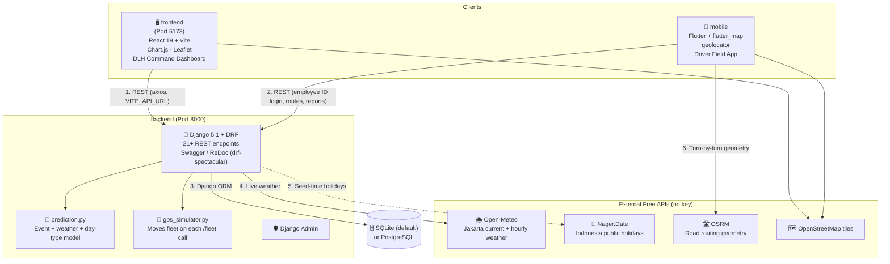
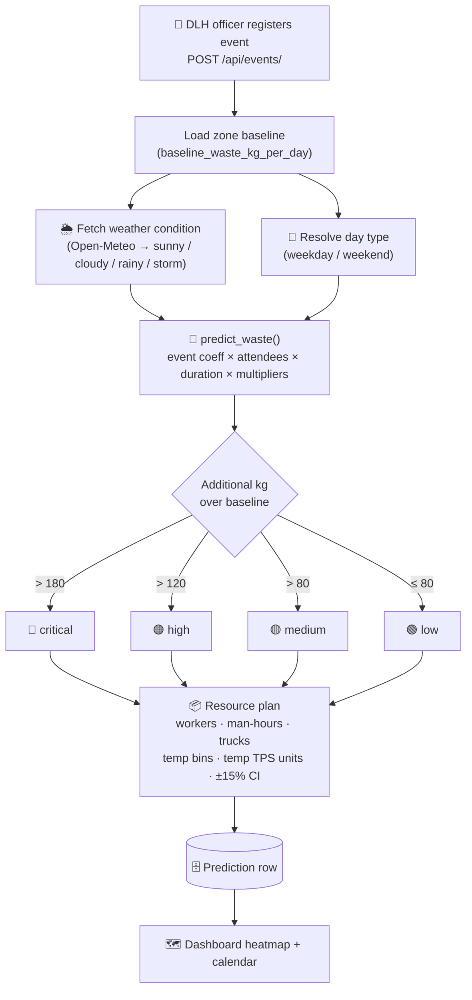
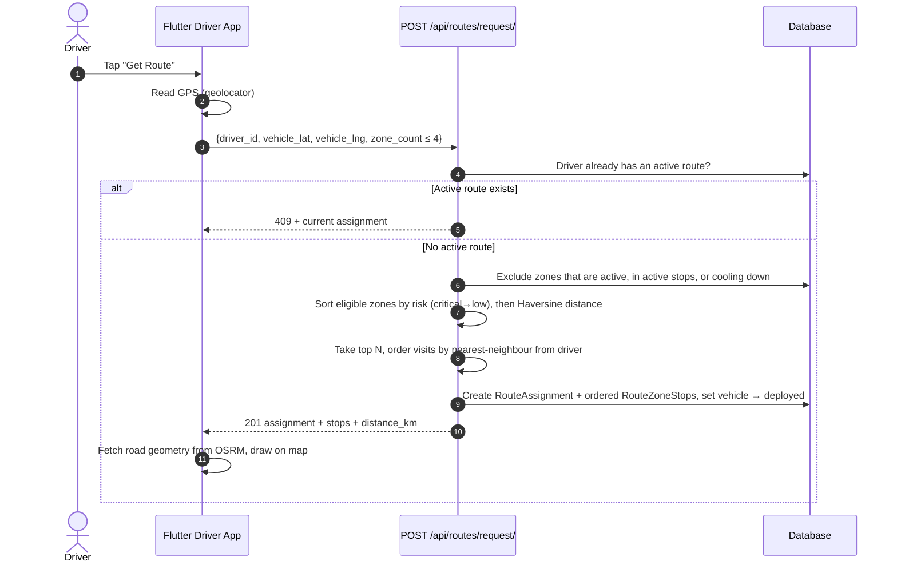
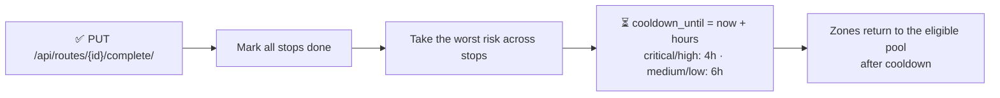
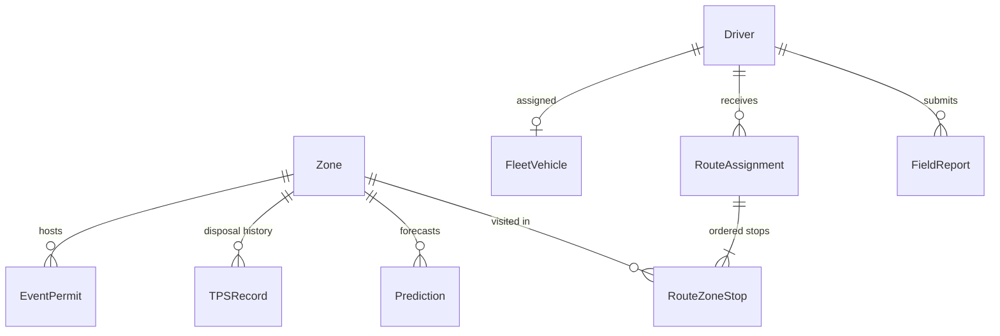

# ♻️ WasteIQ (AI-Powered Waste Volume Prediction Platform)

[](https://www.python.org/)
[](https://www.djangoproject.com/)
[](https://www.django-rest-framework.org/)
[](https://react.dev)
[](https://vitejs.dev)
[](https://flutter.dev)
[](https://www.postgresql.org/)
[]()

This repository was built for the **AI Open Innovation Challenge 2026, Case 2: Waste Volume Prediction** by the **AI See You Team** at President University.

WasteIQ helps a city sanitation agency (DLH Jakarta) **predict waste surges before they happen** and **dispatch cleaning crews to where they matter most**. It combines crowd-event permits, live weather, public holidays and historical TPS (landfill) disposal data into per-zone waste forecasts. A **React command dashboard** turns those forecasts into dispatch decisions, and a **Flutter driver app** hands out risk-prioritised cleaning routes in the field.

---

## 📋 Table of Contents

- [🏛️ System Architecture](#️-system-architecture)
- [📦 Applications](#-applications)
- [🔄 Core Data Flows](#-core-data-flows)
  - [1. Event → Waste Prediction Pipeline](#1-event--waste-prediction-pipeline)
  - [2. Smart Route Assignment (Driver App)](#2-smart-route-assignment-driver-app)
  - [3. Route Completion & Zone Cooldown](#3-route-completion--zone-cooldown)
- [🧮 Prediction Model](#-prediction-model)
- [📊 Data Model & Data Strategy](#-data-model--data-strategy)
- [🔌 API Reference](#-api-reference)
- [⚡ Local Development Setup](#-local-development-setup)
- [🔑 Environment Variables](#-environment-variables)
- [🛠️ Troubleshooting](#️-troubleshooting)
- [📄 Team & Credits](#-team--credits)

---

## 🏛️ System Architecture



---

## 📦 Applications

| Directory | Application | Stack | Responsibility | Port |
| :--- | :--- | :--- | :--- | :--- |
| 🐍 **[`backend`](./backend)** | **WasteIQ API** | Django 5.1, DRF 3.15, drf-spectacular, NumPy, Gunicorn, WhiteNoise | Prediction engine, zones, events, fleet GPS simulation, route assignment, field reports, CSV data import, admin panel. | `8000` |
| 🖥️ **[`frontend`](./frontend)** | **DLH Command Dashboard** | React 19, Vite 8, Chart.js 4, React-Leaflet 5 | 11 pages: Dashboard, Map (risk heatmap), Predictions, Calendar, Simulator, Fleet, Drivers, Routes, Reports, Model Performance, Data Import. | `5173` |
| 📱 **[`mobile`](./mobile)** | **Driver Field App** | Flutter (Dart 3.11), flutter_map, geolocator, http | Screens: Login (employee ID), Route List (Get / Complete Route), Map with risk circles + OSRM route, Field Report with GPS capture, History. | — |

---

## 🔄 Core Data Flows

### 1. Event → Waste Prediction Pipeline

Registering a crowd permit (a concert, food festival, marathon…) **automatically generates a prediction** for its zone:



### 2. Smart Route Assignment (Driver App)



Each zone goes to one driver only. While a zone is in someone's active route, no other driver can be assigned it.

### 3. Route Completion & Zone Cooldown



---

## 🧮 Prediction Model

The model is implemented in [`backend/api/prediction.py`](./backend/api/prediction.py):

```text
event_waste_kg = (event_coeff × attendees / 100) × (duration_h / 6) × weather_mult × day_mult
total_waste_kg = zone_baseline_kg + event_waste_kg
```

| Factor | Values |
| :--- | :--- |
| **Event coefficient** | food_festival 18.5 · night_market 14.2 · street_market 12.3 · concert 9.2 · exhibition 8.1 · sports_match 7.5 · political_rally 6.8 · religious_gathering 5.9 · marathon 4.1 · other 7.0 |
| **Weather multiplier** | sunny 1.00 · cloudy 1.05 · rainy 1.15 · storm 1.35 |
| **Day multiplier** | weekday 1.00 · weekend 1.25 · holiday 1.45 |
| **Risk (kg over baseline)** | critical > 180 · high > 120 · medium > 80 · low ≤ 80 |
| **Resources** | workers = max(2, total/200 + 1) · trucks = max(1, total/3000 + 1) · temp bins = extra/500 · temp TPS = extra/2000 |

A **Scenario Simulator** (`POST /api/simulator/`) runs the same model on "what if" inputs without saving anything.

---

## 📊 Data Model & Data Strategy

**9 Django models** in [`backend/api/models.py`](./backend/api/models.py), all registered in Django Admin:



| Data | Source | Type |
| :--- | :--- | :--- |
| 30 Jakarta zone coordinates | Real zone coordinates | Real |
| Weather (current + 24h forecast) | Open-Meteo | Real |
| Indonesia public holidays | Nager.Date | Real |
| TPS disposal history (90 days) | Seed script with realistic noise | Synthetic |
| Crowd permit events (10 demo) | Seed script | Synthetic |
| Fleet GPS positions | `gps_simulator.py` (moves trucks toward targets) | Simulated |
| 10 demo drivers (`DLH-2001` … `DLH-2010`) | Seed script, 2 per Jakarta area | Synthetic |

---

## 🔌 API Reference

With the backend running: **Swagger UI** at `/api/docs/` (served locally, no CDN), **ReDoc** at `/api/redoc/`, and the raw **OpenAPI 3** schema at `/api/schema/`.

| Method | Endpoint | Description |
| :--- | :--- | :--- |
| GET | `/api/zones/` · `/api/zones/<id>/` | Zones with risk level · zone detail + 24h predictions |
| GET / POST | `/api/events/` | List crowd permits · register one (auto-predicts) |
| GET | `/api/events/calendar/` | Events grouped by date with waste totals |
| GET | `/api/predictions/` | All predictions (filter: zone, date, risk) |
| POST | `/api/predictions/generate/` | Run a prediction for a zone |
| GET | `/api/predictions/heatmap/` | All zones with risk + colour for the map |
| POST | `/api/simulator/` | Scenario simulator |
| GET | `/api/fleet/` · `/api/fleet/<id>/` | Fleet vehicles (GPS ticks on each call) · vehicle detail |
| POST | `/api/fleet/dispatch/` | Dispatch trucks to a zone |
| GET | `/api/drivers/` | All drivers |
| POST | `/api/drivers/<id>/report/` | Submit a field report |
| GET | `/api/routes/` | All route assignments (admin view) |
| GET | `/api/routes/my/?driver_id=<id>` | Driver's current active assignment |
| POST | `/api/routes/request/` | Auto-assign a multi-stop route to a driver |
| PUT | `/api/routes/<id>/complete/` | Complete a route → sets zone cooldowns |
| GET | `/api/reports/summary/` | Executive dashboard data |
| GET | `/api/model/performance/` | Prediction accuracy metrics |
| GET | `/api/weather/current/` · `/api/weather/forecast/` | Jakarta live weather · 24h forecast |
| POST | `/api/data/import/` | Import TPS records from CSV |

---

## ⚡ Local Development Setup

### Prerequisites

- **Python 3.12+**
- **Node.js 20+** & npm
- **Flutter SDK** (Dart 3.11+) with Xcode / Android Studio
- **PostgreSQL** (optional; SQLite is the default)

### 1. Backend

```bash
cd backend
pip3 install -r requirements.txt
python3 manage.py migrate
python3 manage.py seed_data                 # 30 zones, 90 days of TPS, events, drivers, fleet
python3 manage.py runserver 0.0.0.0:8000    # 0.0.0.0 so a phone on the same Wi-Fi can reach it
```

| URL | What |
| :--- | :--- |
| http://localhost:8000/api/ | REST API |
| http://localhost:8000/api/docs/ | Swagger UI |
| http://localhost:8000/admin/ | Django Admin (dev login `admin` / `admin1234`) |

> **PostgreSQL mode:** prefix commands with `USE_POSTGRES=true`.

### 2. Frontend Dashboard

```bash
cd frontend
npm install
npm run dev          # http://localhost:5173
```

### 3. Flutter Driver App

```bash
cd mobile
flutter pub get
flutter run
```

Set `baseUrl` in `mobile/lib/services/api_service.dart` for your target:

| Platform | `baseUrl` |
| :--- | :--- |
| iOS Simulator | `http://127.0.0.1:8000/api` |
| Android Emulator | `http://10.0.2.2:8000/api` |
| Real device (same Wi-Fi) | `http://<your-mac-ip>:8000/api` (find it with `ipconfig getifaddr en0`) |

Log in with any demo employee ID from **`DLH-2001`** to **`DLH-2010`**.

---

## 🔑 Environment Variables

| Variable | Scope | Default | Description |
| :--- | :--- | :--- | :--- |
| `SECRET_KEY` | backend | `django-insecure-wasteiq-dev-key...` | Django secret. **Replace it in production** |
| `DEBUG` | backend | `true` | Django debug mode |
| `DATABASE_URL` | backend | — | If set, used via `dj-database-url` (overrides everything below) |
| `USE_POSTGRES` | backend | — | If set, use local PostgreSQL instead of SQLite |
| `DB_NAME` / `DB_USER` / `DB_PASSWORD` | backend | `wasteiq_db` / `postgres` / `1234` | Local PostgreSQL credentials |
| `DB_HOST` / `DB_PORT` | backend | `localhost` / `5432` | Local PostgreSQL host |
| `VITE_API_URL` | frontend | `http://localhost:8000/api` | API base URL for the dashboard |

Deployment configs are included for **Railway / Nixpacks** (`backend/railway.toml`, `Procfile`, Gunicorn + WhiteNoise) and **Vercel** (`vercel.json` SPA rewrites).

---

## 🛠️ Troubleshooting

### Q1: `ModuleNotFoundError: No module named 'django'` on macOS
**Solution:** Your `python3` may not be the one pip installed into. Use a virtualenv (`python3 -m venv .venv && source .venv/bin/activate`). Or prefix commands with `PYTHONPATH=/Library/Frameworks/Python.framework/Versions/3.13/lib/python3.13/site-packages`.

### Q2: The Flutter app can't reach the API on a real phone
**Solution:** Run the server on `0.0.0.0:8000`, not the default `127.0.0.1`. Put the phone and the Mac on the same Wi-Fi, and use the Mac's LAN IP in `baseUrl`. iOS ATS is already configured to allow plain HTTP.

### Q3: "No eligible zones available right now" (503)
**Solution:** Every zone is either in an active route or cooling down. Complete an active route, wait out the cooldown, or re-run `seed_data` for a fresh demo.

### Q4: The SQLite database is missing after cloning
**Solution:** `db.sqlite3` is git-ignored. Run `migrate` + `seed_data` to create it.

---

## 📄 Team & Credits

- **Team:** AI See You Team, President University
- **Team Leader:** Myat Min Thu ([@Myat06](https://github.com/Myat06))
- **Event:** AI Open Innovation Challenge 2026, Case 2 (Waste Volume Prediction)
- **Open data & services:** Open-Meteo, Nager.Date, OpenStreetMap, OSRM
- **Further reading:** [`SYSTEM_BREAKDOWN.md`](./SYSTEM_BREAKDOWN.md) has the full component breakdown
